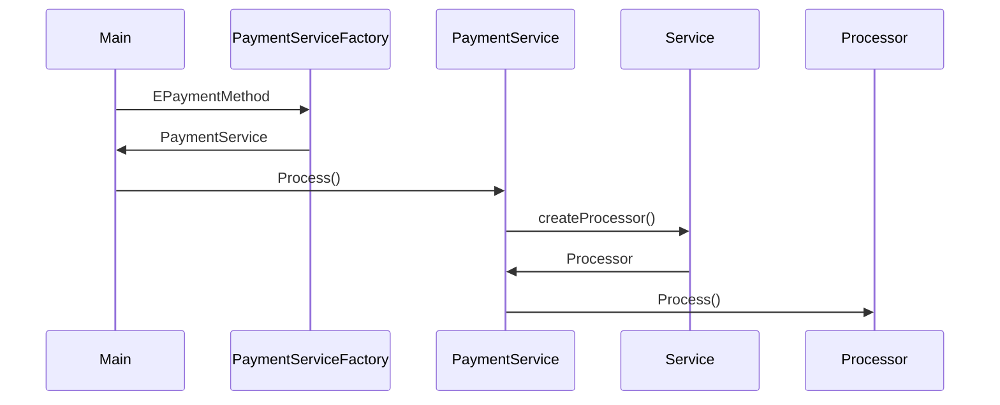
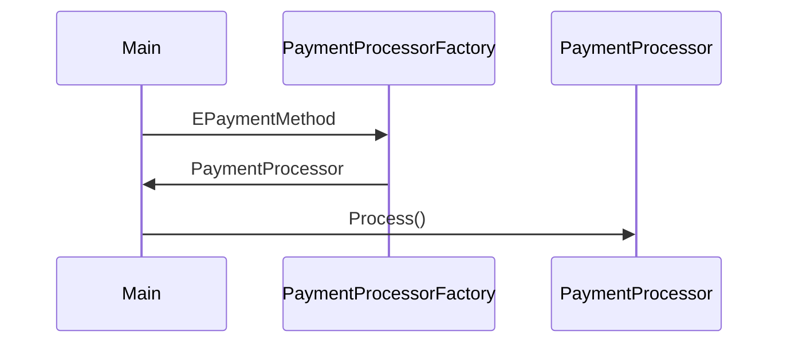

# Factory vs Spring Framework!

Cenário de teste:

> Desenvolva duas versões (PoC) de um sistema de pagamentos e-commerce que ofereça suporte a três métodos de pagamento, que serão definidos no instante de build do projeto.
O sistema deverá ser desenvolvido em Java, utilizando padrões de projeto como factory e polimorfismo, e Spring Framework, adotando como premissa a utilização de injeção de dependências.
> 
> 
> **Nota importante:** busque manter um baixo acoplamento entre componentes.
> 
> Métodos de pagamento:
> 
> - Cartão de crédito
> - Pix
> - Paypal

# Injeção de dependências e IoC

**IoC** (Inversion of Control) é um conceito que muda a forma como o fluxo de execução e a criação de objetos são gerenciados. Em vez do próprio código instanciar e controlar seus objetos, essa responsabilidade é passada para um framework ou container, como o Spring. Isso deixa o código mais flexível e modular, pois evita dependências diretas entre os componentes.

**DI** (Dependency Injection) é uma forma de aplicar **IoC**, onde um objeto recebe suas dependências de fora, em vez de criá-las internamente. No Spring, o próprio framework cuida dessa injeção automaticamente, garantindo que os objetos necessários sejam fornecidos na hora certa. Isso facilita a manutenção, melhora a testabilidade e reduz o acoplamento entre as partes do sistema.

# Implementação em Java "puro"

É notório que adotar o *pattern* factory em uma solução tão simples pode ser complexidade desnecessária no projeto, entretanto a criação de diversas classes, interfaces e possivelmente até classes abstratas, promove uma divisão de responsabilidades muito bem definida, o que torna fácil a manutenção do código como um todo.

Fluxo simples



Estrutura de pastas


Classe  main 

```java
public class Main {
    public static void main(String[] args) {
        PaymentService service;

        System.out.println("Pix payment");
        service = PaymentServiceFactory.createService(EPaymentMethod.PIX);
        pay(service, 100);

        System.out.println("Paypal payment");
        service = PaymentServiceFactory.createService(EPaymentMethod.PAYPAL);
        pay(service, 110);

        System.out.println("Credit card payment");
        service = PaymentServiceFactory.createService(EPaymentMethod.CREDIT_CARD);
        pay(service, 300);
    }

    static void pay(PaymentService service, double amount) {
        service.process(amount);
    }
}
```

Enum - EPaymentMethod

```java
public enum EPaymentMethod {
    CREDIT_CARD("Credit card"),
    PIX("Pix"),
    PAYPAL("Paypal");

    private final String description;

    EPaymentMethod(String description) {
        this.description = description;
    }

    public String getDescription() {
        return description;
    }
}
```

Classe Factory - PaymentServiceFactory 

```java
public class PaymentServiceFactory {
    public static PaymentService createService(EPaymentMethod method){
        switch (method) {
            case PAYPAL:
                return new PaypalService();

            case PIX:
                return new PixService();

            case CREDIT_CARD:
                return new CreditCardService();

            default:
                throw new RuntimeException();
        }
    }
}
```

Classe abstrata - PaymentService

```java
public abstract class PaymentService {

    public void process(double amount){
        IPaymentProcessor processor = createProcessor();

        processor.process(amount);
    }

    public abstract IPaymentProcessor createProcessor();
}
```

Implementação concreta - PaypalService

```java
public class PaypalService extends PaymentService {

    @Override
    public IPaymentProcessor createProcessor() {
        return new PaypalPaymentProcessor();
    }
}
```

Implementação concreta - PixService

```java
public class PixService extends PaymentService {

    @Override
    public IPaymentProcessor createProcessor() {
        return new PixPaymentProcessor();
    }
}
```

Implementação concreta - CreditCardService

```java
public class CreditCardService extends PaymentService {

    @Override
    public IPaymentProcessor createProcessor() {
        return new CreditCardPaymentProcessor();
    }
}
```

Interface - IPaymentProcessor

```java
public interface IPaymentProcessor {
    public void process(double amount);
}
```

Implementação concreta - PaypalPaymentProcessor  

```java
public class PaypalPaymentProcessor  implements IPaymentProcessor {

    @Override
    public void process(double amount) {
        System.out.println(EPaymentMethod.PAYPAL.getDescription() + " payment processing " + amount + " euros");
    }
}
```

Implementação concreta - CreditCardPaymentProcessor

```java
public class CreditCardPaymentProcessor  implements IPaymentProcessor {

    @Override
    public void process(double amount) {
        System.out.println(EPaymentMethod.CREDIT_CARD.getDescription() + " payment processing " + amount + " euros");

    }
}
```

Implementação concreta - PixPaymentProcessor

```java
public class PixPaymentProcessor implements IPaymentProcessor {

    @Override
    public void process(double amount) {
        System.out.println(EPaymentMethod.PIX.getDescription() + " payment processing " + amount + " euros");
    }
}
```

# Implementação com Spring

Utilizando o Framework Spring, torna-se simples a utilização e criação de objetos, não é necessário esforços ao se criar os objetos concretos e mesmo assim eles continuam sendo protegidos. Sua implementação é caracterizada por uma complexidade relativamente baixa, tendo em vista que são descartadas classes intermediadoras utilizando essa abordagem, o que torna fácil de gerir, manutenir e entender.

Fluxo simples



Estrutura de pastas


Classe main 

```java
@SpringBootApplication
public class PaymentApplication  implements CommandLineRunner {
    @Autowired
    PaymentProcessorFactory paymentProcessorFactory;

    public static void main(String[] args) {
       SpringApplication.run(PaymentApplication.class, args);
    }

    @Override
    public void run(String... args) {
       System.out.println("Pix payment");
       var processor = paymentProcessorFactory.getPaymentProcessor(EPaymentMethod.PIX);
       pay(processor, 100);

       System.out.println("Paypal payment");
       processor = paymentProcessorFactory.getPaymentProcessor(EPaymentMethod.PAYPAL);
       pay(processor, 134);

       System.out.println("Credit card payment");
       processor = paymentProcessorFactory.getPaymentProcessor(EPaymentMethod.CREDIT_CARD);
       pay(processor, 200);
    }

    public void pay(IPaymentProcessor processor, int amount) {
       processor.process(amount);
    }
}
```

Enum - EPaymentMethod

```java
public enum EPaymentMethod {
    CREDIT_CARD("Credit card"),
    PIX("Pix"),
    PAYPAL("Paypal");

    private final String description;

    EPaymentMethod(String description) {
        this.description = description;
    }

    public String getDescription() {
        return description;
    }
}
```

Interface - IPaymentProcessor

```java
public interface IPaymentProcessor {
    public void process(double amount);
}
```

Classe factory - PaymentProcessorFactory 

```java
@Service
@RequiredArgsConstructor
public class PaymentProcessorFactory {
    private final Map<String, IPaymentProcessor> paymentProcessorMap;

    public IPaymentProcessor getPaymentProcessor(EPaymentMethod paymentMethod) {
        return paymentProcessorMap.get(paymentMethod.getDescription());
    }
}
```

Classe concreta - PaypalProcessor 

```java
@Service(PaypalProcessor.BEAN_ID)
public class PaypalProcessor implements IPaymentProcessor {
    public static final String BEAN_ID = "paypalService";

    @Override
    public void process(double amount) {
        System.out.println("Paypal service processing " + amount);
    }
}
```

Classe concreta - CreditCardProcessor 

```java
@Service(PaypalProcessor.BEAN_ID)
public class CreditCardProcessor implements IPaymentProcessor {
    public static final String BEAN_ID = "creditCardService";

    @Override
    public void process(double amount) {
        System.out.println("Credit card service processing " + amount);
    }
}
```

Classe concreta - PixProcessor 

```java
@Service(PixProcessor.BEAN_ID)
public class PixProcessor implements IPaymentProcessor {
    public static final String BEAN_ID = "pixService";

    @Override
    public void process(double amount) {
        System.out.println("Pix service processing " + amount);
    }
}
```

# Comparação entre abordagens

A implementação com Spring simplifica a criação e gerenciamento de objetos por meio da Injeção de Dependência, eliminando a necessidade de instanciar manualmente classes concretas e reduzindo a complexidade do código. Em contrapartida, a abordagem em Java "puro" exige a criação explícita de instâncias, frequentemente utilizando *patterns* como Factory para modularizar a lógica e definir responsabilidades com mais precisão. Embora o uso do Spring reduza o código boilerplate e facilite a manutenção, a abordagem manual pode oferecer maior controle sobre a estrutura do sistema, sendo mais indicada para cenários onde a flexibilidade e a customização são prioridades.
